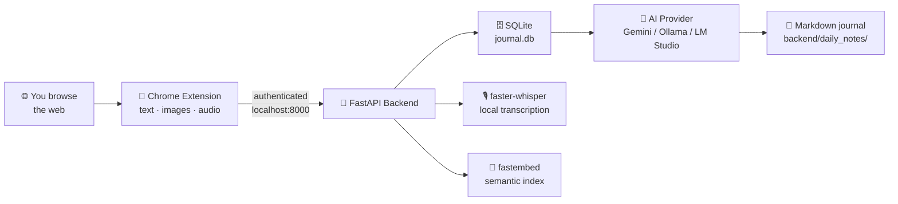

<div align="center">

# 📔 Everyday Summariser

**A private, AI-powered journal of everything you browse — generated on your own machine.**


[Quick Start](#-quick-start) · [Features](#-features) · [How It Works](#-how-it-works) · [Privacy](#-privacy--security) · [API](#-api-reference)

</div>

---

## What is this?

Everyday Summariser is a Chrome extension + local Python backend that quietly records the text, images, and audio you encounter while browsing. At the end of the day, one click hands that data to an AI model — Gemini, LM Studio, or Ollama — which turns it into a clean, categorized Markdown journal saved on your machine.

Think of it as a **second brain for your web browsing**: searchable, private, and built without you having to lift a finger during the day.

<details>
<summary><b>📖 The longer story</b></summary>

<br>

Every day, we consume massive amounts of digital information — reading articles, watching videos, conducting research, and scrolling through social media. Yet, keeping track of what we actually learned or saw remains tedious and time-consuming. We realized we needed a completely frictionless way to capture our daily digital footprint and automatically synthesize it into a clean, searchable journal, all without interrupting our actual workflow.

To solve this, I built **Everyday Summariser**. It's a Chrome extension that silently and privately records the text, images, and audio you interact with as you browse, securely passing this data to a local Python backend. At the end of the day, a single click triggers an AI model — like Google's Gemini, LM Studio, or Ollama — to process all that scattered data.

The end result is a beautifully formatted, private Markdown journal generated right on your machine every single day.

</details>

---

## 🚀 Quick Start

### Step 1 — Start the backend

Pick **one** of the two options below.

<details open>
<summary><b>🐳 Option A — Docker (recommended)</b></summary>

<br>

No Python installation required.

1. Install [Docker Desktop](https://www.docker.com/products/docker-desktop/).
2. Copy the example config and set your AI provider:
   ```bash
   cp backend/.env.example backend/.env
   ```
3. From the project root (where `docker-compose.yml` lives):
   ```bash
   docker-compose up -d
   ```

The server runs in the background on **`http://localhost:8000`**. Stop it with `docker-compose down`.
All data — database, audio, notes — persists in your local `backend/` folder.

</details>

<details>
<summary><b>⚡ Option B — 1-click scripts (no Docker)</b></summary>

<br>

These scripts create a Python virtual environment, install dependencies, and start the server for you.

| Platform | Command |
|---|---|
| **Windows** | Double-click `start_windows.bat` |
| **macOS / Linux** | `./start_mac.sh` |

On the very first run, the script creates a default `backend/.env` for you. You can configure the AI provider there *or* directly in the extension's Onboarding Wizard / Settings page.

</details>

### Step 2 — Load the Chrome extension

1. Open `chrome://extensions/`
2. Toggle **Developer mode** (top right)
3. Click **Load unpacked** → select the `extension/` folder
4. The **Onboarding Wizard** opens automatically to walk you through backend, AI, and privacy setup

### Step 3 — Browse, then generate

Just use the web normally. When you're ready, click **Generate Daily Note** from the popup, side panel, or dashboard.

Your journal lands in **`backend/daily_notes/`** as Markdown. 🎉

---

## ⚙️ AI Configuration

Set these in `backend/.env` (or via the extension's Settings page).

<table>
<tr><th width="50%">☁️ Google Gemini</th><th width="50%">🏠 Local (LM Studio / Ollama)</th></tr>
<tr valign="top">
<td>

```env
AI_PROVIDER=gemini
GEMINI_API_KEY=your_api_key_here
```

Excerpts used to build the journal are sent to Google.

</td>
<td>

```env
AI_PROVIDER=local
LOCAL_AI_ENDPOINT=http://localhost:11434/v1
LOCAL_MODEL_NAME=qwen2.5:3b
```

Nothing leaves your machine.

</td>
</tr>
</table>

> **Default endpoints** — Ollama: `http://localhost:11434/v1` · LM Studio: `http://localhost:1234/v1`

---

## 🔄 How It Works



---

## ✨ Features

<details open>
<summary><b>🎯 Smart Content Capture</b></summary>

| Capability | What it does |
|---|---|
| **Readability-based extraction** | Uses Mozilla's Readability.js to cleanly extract article text, stripping ads and navigation. Falls back to DOM heuristics and raw text when needed. |
| **Image context** | Captures source URLs of significant images, filtering out tiny tracking pixels and icons. |
| **Audio + local transcription** | Records audio from tabs playing sound and transcribes it locally with `faster-whisper`. Recordings rotate every 10 minutes so each file is a complete, decodable webm. |
| **Highlight to save** | Select text → right-click *Save highlight to journal*, or press `Ctrl+Shift+S`. Highlights are the highest-signal input and get quoted verbatim. |
| **Engagement-aware** | A page is recorded once, when you leave it, and only if you actually looked at it past the dwell threshold. Same-day revisits merge into one entry with a visit count. |
| **YouTube transcripts** | Automatically pulls captions via the built-in timedtext API. |
| **PDF extraction** | Captures text from PDFs opened in Chrome using pdf.js. |
| **Twitter/X threads** | Extracts full thread text from status pages. |
| **Domain blocklist** | Exclude domains from capture entirely — banking, email, whatever you want off the record. |

</details>

<details>
<summary><b>🤖 AI-Powered Summaries</b></summary>

- **Categorized daily journals** — grouped by topic (Research, Entertainment, News…) with relevant emoji
- **Key takeaways** — the most important learnings and facts from each page
- **Time-based sections** — Morning / Afternoon / Evening, based on timestamps
- **Mood & productivity analysis** — inferred focus areas plus a focus score
- **Weekly & monthly rollups** — auto-scheduled (Sunday & the 1st), or generated manually anytime

</details>

<details>
<summary><b>💬 Ask Your History</b></summary>

- **Semantic search** — a local embedding index (`fastembed`, ONNX — no torch, no cloud) finds things by *meaning*, so "scheduling reminders" surfaces a podcast you listened to even though those words never appear on any page you read
- **Ask with citations** — answers built only from your own browsing, with bracketed citations back to the source. If the AI model is unreachable, matching sources are still shown
- **Omnibox** — type `es ` followed by a query in the address bar to search without opening anything

</details>

<details>
<summary><b>📊 Insights</b></summary>

- **Time by site** — where attention actually went, from dwell data already being collected
- **Meant to read** — long pages you opened but barely looked at; the things you intended to come back to
- **Export to Obsidian** — write every journal and highlight to a vault folder as Markdown with `[[wikilinks]]`
- **History import** — backfill titles and URLs from recent browsing so a fresh install isn't empty on day one
- **Pause capture** — stop for 30 or 60 minutes; it resumes on its own

</details>

<details>
<summary><b>🔍 Search & Organize</b></summary>

- **Full-text search** — SQLite FTS5 across all captured text, YouTube transcripts, PDFs, Twitter threads, and generated notes
- **Tag system** — colored tags on specific pages for easy recall
- **Journal timeline** — browse past daily, weekly, and monthly notes with full Markdown rendering
- **Raw data browser** — explore all captured content with pagination and filtering

</details>

<details>
<summary><b>🎮 Retro 8-bit Pixel Art UI</b></summary>

| Surface | Purpose |
|---|---|
| **Full-tab dashboard** | The primary experience — journal timeline, search, raw data browser, tags, generate controls, settings. NES-inspired pixel art styling. |
| **Side panel** | Lightweight companion showing today's stats and quick actions alongside your browsing. |
| **Popup** | Quick-status hub with stats, generate button, and dashboard/side-panel launchers. |
| **Themes** | Dark & light, both retro, with a CRT scanline overlay. |
| **Onboarding wizard** | First-run multi-step setup for backend, AI, and privacy. |

</details>

---

## 🔒 Privacy & Security

| | |
|---|---|
| 🗄️ **Local storage** | All captured data lives in a local SQLite database (`journal.db`). Notes are plain Markdown in `backend/daily_notes/`. |
| 🎙️ **Audio never leaves your machine** | Transcription always runs locally via `faster-whisper`, whichever AI provider you pick. |
| 🤖 **Summarisation depends on your provider** | `AI_PROVIDER=local` (Ollama / LM Studio) → nothing leaves your machine. `AI_PROVIDER=gemini` → journal excerpts are sent to Google. |
| 🔑 **The backend is authenticated** | Every `/api` route requires a token the extension fetches from `/api/pair`, which only answers requests from a `chrome-extension://` origin. Without it, any page you visit could read your journal from `localhost:8000` — or wipe it. |

---

## 📅 Daily Usage

1. Make sure the backend is running (`uvicorn main:app`, or via Docker / the start scripts).
2. Browse normally — capture happens silently in the background.
3. **Quick check:** click the extension icon for today's stats and quick actions.
4. **Generate:** hit **Generate Daily Note** from the popup, side panel, or dashboard.
5. **Explore:** open **📊 Dashboard** for the journal timeline, search, tags, raw data browser, and settings.
6. **Alongside browsing:** use Chrome's side panel for the lightweight companion view.
7. **Read:** your notes are Markdown files in `backend/daily_notes/`.

---

## 📁 Project Structure

```
EverydaySummariser/
├── backend/              # FastAPI app — storage, transcription, AI generation
│   ├── main.py           #   API routes
│   ├── database.py       #   SQLite schema & queries
│   ├── embeddings.py     #   Semantic index (fastembed)
│   ├── transcription.py  #   Local audio transcription (faster-whisper)
│   ├── daily_notes/      #   📝 Your generated journals live here
│   └── .env              #   AI provider configuration
├── extension/            # Manifest V3 Chrome extension
│   ├── background.js     #   Service worker & capture orchestration
│   ├── content.js        #   Page text/image extraction
│   ├── dashboard.*       #   Full-tab retro dashboard
│   ├── popup.* │ sidepanel.* │ onboarding.*
│   └── youtube.js │ pdf-capture.js │ twitter.js
├── docker-compose.yml
├── start_windows.bat     # 1-click start (Windows)
└── start_mac.sh          # 1-click start (macOS / Linux)
```

---

## 📡 API Reference

Base URL: `http://localhost:8000`. All routes require the pairing token except `/api/health` and `/api/pair`.

<details>
<summary><b>📥 Capture</b></summary>

| Endpoint | Method | Description |
|---|---|---|
| `/api/text` | POST | Save captured page text |
| `/api/images` | POST | Save captured image URLs |
| `/api/audio` | POST | Save captured audio file |
| `/api/youtube` | POST | Save YouTube transcript |
| `/api/pdf` | POST | Save extracted PDF text |
| `/api/twitter` | POST | Save Twitter thread text |
| `/api/highlights` | GET/POST | List or save explicitly highlighted passages |
| `/api/highlights/{id}` | DELETE | Delete a highlight |
| `/api/backfill-history` | POST | Import browser history (metadata only) |

</details>

<details>
<summary><b>🧠 AI & Search</b></summary>

| Endpoint | Method | Description |
|---|---|---|
| `/api/search?q=...` | GET | Full-text search (includes highlights and transcripts) |
| `/api/semantic-search?q=...` | GET | Meaning-based search over the embedding index |
| `/api/ask?q=...` | POST | Answer a question from your history, with citations |
| `/api/index-status` | GET | Embedding index chunk counts |
| `/api/index-now` | POST | Index new content immediately |
| `/api/transcription-status` | GET | Transcription queue counts by status |
| `/api/transcribe-now` | POST | Drain the transcription queue immediately |

</details>

<details>
<summary><b>📝 Notes & Generation</b></summary>

| Endpoint | Method | Description |
|---|---|---|
| `/api/generate-daily-note` | POST | Generate daily note |
| `/api/generate-weekly-note` | POST | Generate weekly rollup |
| `/api/generate-monthly-note` | POST | Generate monthly rollup |
| `/api/notes` | GET | List all generated notes |
| `/api/notes/{date}` | GET | Get a specific note |
| `/api/export` | POST | Export notes and highlights as Markdown |

</details>

<details>
<summary><b>📊 Insights & Data</b></summary>

| Endpoint | Method | Description |
|---|---|---|
| `/api/stats` | GET | Today's capture counts |
| `/api/analytics?days=N` | GET | Time by site, by day, and top pages |
| `/api/reading-queue` | GET | Long pages you opened but barely read |
| `/api/captured` | GET | Browse raw captured data |
| `/api/clear-today` | POST | Clear today's data |

</details>

<details>
<summary><b>🏷️ Tags & Settings</b></summary>

| Endpoint | Method | Description |
|---|---|---|
| `/api/tags` | GET/POST | List/create tags |
| `/api/tag-page` | POST | Tag a page |
| `/api/tagged-pages` | GET | Get tagged pages |
| `/api/settings` | GET/PUT | Get/update settings |

</details>

<details>
<summary><b>🔧 System</b></summary>

| Endpoint | Method | Description |
|---|---|---|
| `/api/health` | GET | Health check (no token required) |
| `/api/pair` | GET | Returns the API token; only answers `chrome-extension://` origins |

</details>

---

## 📄 License

Released under the [MIT License](LICENSE).

<div align="center">
<br>
<sub>Built for people who read a lot and remember little.</sub>
</div>
